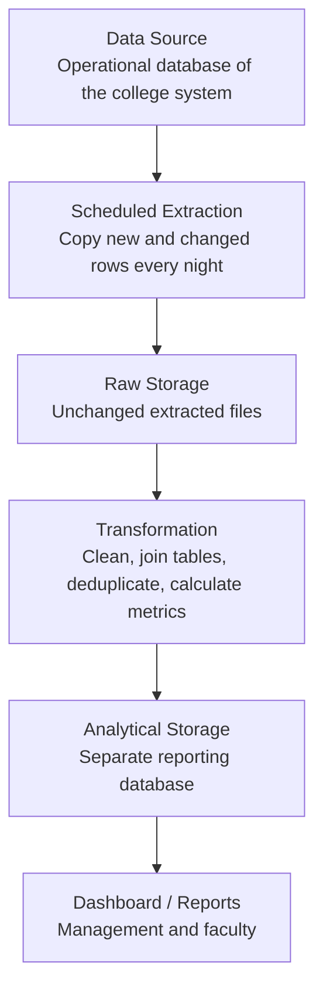
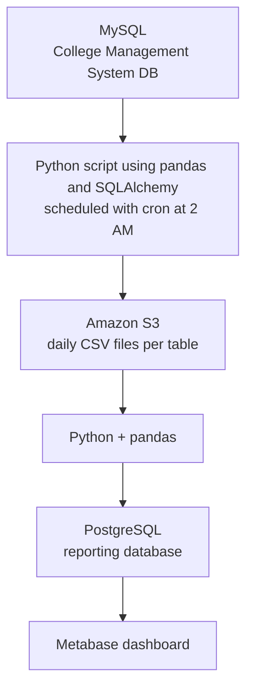

# Data Pipeline Design: College Management System

## 1. Selected Source

**Source:** The College Management System (CMS), the live application that staff and students use every day. Its data sits in a relational database.

**What data it produces:** Structured, transactional data in tables: students, courses, enrollments, daily attendance, exam marks and fee payments. New rows are added constantly (attendance every class, marks every exam) and old rows are sometimes updated (corrected marks, fee status).

**Problem being solved:** The administration wants to answer questions like "Which students are at risk because of low attendance and falling marks?" and "Which courses have the weakest results?" The CMS is built for *recording* data, not for analysis, so we copy the data out and prepare it for reporting.

---

## 2. Diagram 1: Logical Architecture

---

## 3. Diagram 2: Technology Mapping

---

## 4. Component Explanation

| Logical component | Technology | Why it exists |
| --- | --- | --- |
| Data Source | MySQL (CMS database) | It is where the real, up-to-date student, attendance and marks records are created. |
| Scheduled Extraction | Python + pandas + cron | It copies only new or changed rows (using an `updated_at` column) at night, when few people are using the system. |
| Raw Storage | Amazon S3 (CSV files) | It keeps an unchanged copy of each night's extract so we can reprocess it if the cleaning logic is wrong. |
| Transformation | Python + pandas | The data is spread across many tables with errors and duplicates, so it must be joined, cleaned and turned into useful numbers like attendance percentage. |
| Analytical Storage | PostgreSQL (reporting DB) | It holds the final tables in a shape built for reporting, completely separate from the live system. |
| Dashboard / Reports | Metabase | It gives HODs, the exam cell and counselors charts and filters without needing SQL knowledge. |

---

## 5. Question Log

1. **Why can't the dashboard connect directly to the CMS database?** Analysis queries (joining many tables, scanning a whole semester of attendance) are heavy and could slow down the live system while staff are marking attendance. It also risks someone accidentally changing real records.
2. **Why do we extract only new or changed rows instead of copying everything every night?** The full database grows every semester, so copying everything wastes time and storage. Using a "last updated" column keeps each run small, but it means the tables must reliably have that column.
3. **What happens if a mark is corrected after we already extracted it?** The correction changes `updated_at`, so the next night's extract picks it up. Transformation then needs to *update* the existing row rather than add a duplicate, which is why deduplication is a processing step.
4. **If the data is already in a database, why do we need a second database?** The CMS database is organised for fast recording (many small tables to avoid repetition). The reporting database is organised for reading and summarising, for example one table that already combines student, course and attendance percentage.
5. **Is the raw storage layer really needed, or is it overkill?** For a tiny project I could skip it and extract straight into transformation. I kept it because it gives me a replayable history, and it matters more with student data where mistakes can affect decisions.
6. **Student data is personal. How should it be protected in the pipeline?** Only the fields needed for reporting should be extracted, access to S3 and the reporting DB should be restricted, and the transformation step can replace names with student IDs for general dashboards. Full details should be visible only to authorised staff.
7. **Do we need real-time data or is nightly enough?** Nightly is enough, since attendance and marks are reviewed daily or weekly, not by the second. Real-time streaming would add cost and complexity with no benefit for this use case.

---

## 6. Short Architecture Explanation: Why does data move from one component to the next?

- **Source → Extraction:** The records are created in the CMS database, but analysis should not happen there. A nightly script copies out only what changed so the live system is barely affected.
- **Extraction → Raw Storage:** The script's only job is to move data out safely. Saving it unchanged gives us a backup of exactly what we received.
- **Raw Storage → Transformation:** The raw tables are separate, can contain duplicates or missing values, and don't directly answer questions. Transformation joins students with courses, attendance and marks, removes duplicates, and calculates metrics such as attendance % and average marks per course.
- **Transformation → Analytical Storage:** The cleaned results are stored in a database designed for reporting, so queries are fast and don't touch the live system.
- **Analytical Storage → Dashboard:** The people who make decisions need to see patterns, not tables. The dashboard reads the reporting tables and shows charts such as students below 75% attendance or pass rate by course.

**Why this is intentionally simple:** The data is structured, modest in size, and only needed once a day. So there is no streaming, no orchestration tool and no big-data cluster. Each of the two storage layers has a clear job: one keeps a safe copy, the other serves reports.