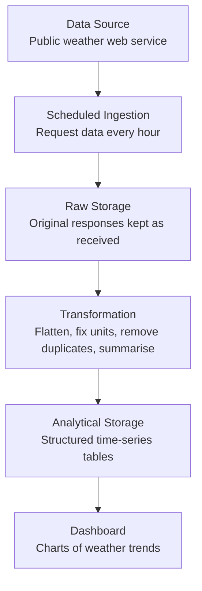
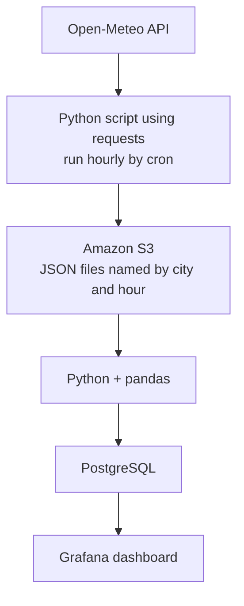

# Data Pipeline Design: Weather API

## 1. Selected Source

**Source:** The Open-Meteo weather API, a free public API that needs no login or API key.

**What data it produces:** Semi-structured JSON with hourly weather values for a given latitude and longitude: temperature, humidity, wind speed, rainfall, and a weather condition code, along with timestamps. It returns the *current and forecast* values, not a long history.

**Problem being solved:** "How do temperature and rainfall change over days and weeks across a set of cities?" Because the API only shows what the weather is *now*, we have to collect readings on a schedule and store them to see trends.

---

## 2. Diagram 1: Logical Architecture

---

## 3. Diagram 2: Technology Mapping

---

## 4. Component Explanation

| Logical component | Technology | Why it exists |
| --- | --- | --- |
| Data Source | Open-Meteo API | It is the origin of the weather measurements and forecasts, and it is free and public. |
| Scheduled Ingestion | Python (`requests`) + cron | The API only gives current values, so a script must call it every hour to build up a history. |
| Raw Storage | Amazon S3 | It stores each API response exactly as received, so we can reprocess it if our cleaning code has a bug. |
| Transformation | Python + pandas | The nested JSON must be flattened into rows, timestamps and units made consistent, and duplicates removed. |
| Analytical Storage | PostgreSQL | It holds clean hourly and daily tables that can be queried quickly with SQL. |
| Dashboard | Grafana | It turns time-series data into line and bar charts so people can see patterns without reading tables. |

---

## 5. Question Log

1. **Why can't the dashboard call the weather API directly?** The API gives only current and forecast data, so there would be no history to chart. Calling it on every dashboard refresh would also be slow and could hit the API's rate limit.
2. **Why store the raw JSON if we are going to clean it anyway?** If I later discover a mistake (for example, a wrong unit conversion), I can re-run the transformation on the original files. If I only kept cleaned data, the original values would be lost.
3. **What happens if the script runs twice for the same hour?** We would get duplicate readings and wrong averages. So transformation must deduplicate on city + timestamp, and the database should reject two rows for the same city and hour.
4. **What if the API is down or returns a missing value?** The script should log the failure and try again next hour, leaving a gap rather than inventing data. Transformation should mark missing values as null so they don't skew the averages.
5. **Why is a database needed for this? Could I just keep the CSV files and build charts from those?** For a small test, yes, that is valid. But a database lets the dashboard ask questions like "average rainfall per city this month" quickly, without loading every file each time.
6. **Is hourly the right frequency, or do I need real-time streaming?** The API itself updates roughly hourly, so pulling more often would just return the same numbers. Streaming (like Kafka) would be extra complexity with no benefit here.
7. **Is the data big enough to need Spark or a data warehouse?** No. Five cities at 24 readings a day is about 120 rows per day, which pandas and PostgreSQL handle easily. Those tools only become useful at millions of rows.

---

## 6. Short Architecture Explanation: Why does data move from one component to the next?

- **Source → Ingestion:** The weather data lives on the provider's servers, and the API only shows "now". A scheduled script fetches it every hour so we collect a history that does not exist anywhere else.
- **Ingestion → Raw Storage:** The script's only job is to fetch and save. Keeping the response untouched gives us a safe copy and keeps the ingestion code very simple.
- **Raw Storage → Transformation:** Raw JSON is nested and inconsistent for analysis. Transformation turns it into clean rows, converts units and time zones, removes duplicates, and computes daily values like minimum, maximum and average temperature and total rainfall.
- **Transformation → Analytical Storage:** Clean data is saved in tables designed for time-based questions, so queries are fast and consistent.
- **Analytical Storage → Dashboard:** People want to see patterns such as "Is this month wetter than last month?" The dashboard reads the tables and draws the charts, which completes the path from raw measurement to a useful answer.

**Why this is intentionally simple:** The data is small, arrives hourly, and has one consumer. So the design has no streaming, no orchestrator and no big-data engine. Each of the two storage layers has one clear job: one keeps the original data safe, the other serves fast queries.